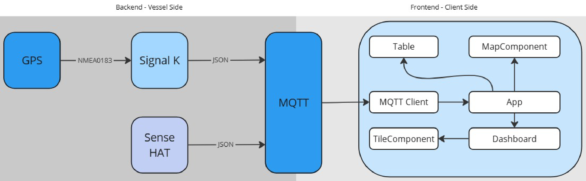

# bashboat

this is a repository for the "bashboat" app created by me for my QMIC internship. bashboat is a naval fleet monitoring system.

# Description

Bashboat is a fleet monitoring system that tracks your vessels and helps you monitor data coming from them.

From a high-level, the backend that runs on a Raspberry PI (RPI) collects the navigation data, such as latitude, longitude, heading speed using the SignalK interface, specifically SignalK serial and the SignalK server. Additionally, the temperature, humidity, and atmospheric pressure values of the surroundings of the RPI are collected as well, and they are embedded with the vessel ID from the SignalK server. These values are published to an MQTT broker with a separate topic for each type of data.

The frontend receives this data from the the MQTT broker itself by subscribing to the topic. The frontend displays the vessels and their navigation data in a sidebar using the Table component and displays the location of the vessels using markers on a map using the MapComponent. The site also contains a dashboard that displays the measurements data from each vessel using the Dashboard component.



# Setup

## Webapp

To start the bashboat webapp, follow the below steps.

1. Download [npm](https://docs.npmjs.com/downloading-and-installing-node-js-and-npm) if you don’t [already have it](https://docs.npmjs.com/downloading-and-installing-node-js-and-npm#:~:text=js%20and%20npm-,Checking%20your%20version%20of%20npm%20and%20Node.js,-To%20see%20if).
2. Download the [.zip file](https://docs.github.com/en/repositories/working-with-files/using-files/downloading-source-code-archives#:~:text=a%20repository.%22-,Downloading%20source%20code%20archives,-You%20can%20download) or [clone](https://learn.microsoft.com/en-us/azure/developer/javascript/how-to/with-visual-studio-code/clone-github-repository?tabs=command-palette#:~:text=Clone%20and%20use%20a%20GitHub%20repository%20in%20Visual%20Studio%20Code) the [github repository](https://github.com/mombash/bashboat) locally.
3. Run the following command in a terminal from the folder you have the project in.
   hint: this is the folder that contains the `package.json` file of the app.

```cpp
npm install
npm run dev
```

1. `CTRL + CLICK` the link that appears in the terminal.

```cpp
> bashboat-app@0.0.0 dev
> vite

  VITE v5.3.3  ready in 1085 ms

  ➜  Local:   http://localhost:5173/
  ➜  Network: use --host to expose
  ➜  press h + enter to show help
```

## Data Acquisition

Bashboat is created to acquire data from NMEA0183 GPS sensors connected to a Signal K server. Additionally, it can recieve various environmental measurements from sensors on a vessel with an existing Signal K server. It was tested using the [SparkFun RTK Express](https://www.sparkfun.com/products/18442) and the [Raspberry PI Sense HAT](https://www.raspberrypi.com/products/sense-hat/).

To run a python file from any device with python from a UNIX-like terminal:

```cpp
python3 fileName.py
```

### From a PC

You send dummy data or live data from the PC. The live data won’t contain any measurements data since the Sense HAT cannot be connected to a PC

1. **Live data**: To send live data, run `backend-pc.py` and enter `live` .
2. **Dummy data**: To send dummy data, run `backend-pc.py` and enter `mixed` .

### From a Raspberry PI

This script can send both dummy and live data. The using a Raspberry PI with the Sense HAT connected will allow you to access the full live functionality of bashboat. Additionally, `backend-rpi.py` only runs on a Raspberry PI

1. **Live data:** Run `backend-rpi.py` and enter `live` .
2. **Dummy data:** Run `backend-rpi.py` and enter `mixed` .
